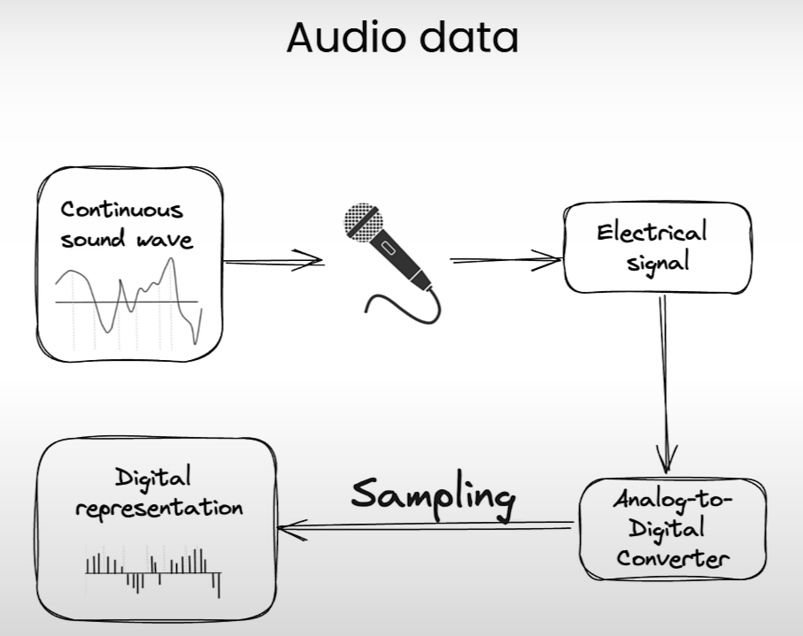

Bueno, clasificacion de audio tiene varias aplicaciones

Ahora en el notebook hay varios ejemplos de como usar el modelo.

Estaremos usando el modelo [laion/clap-htsat-unfused](https://huggingface.co/laion/clap-htsat-unfused) con el dataset [ashraq/esc50](https://huggingface.co/datasets/ashraq/esc50) de HuggingFace.

Bueno aqui esta un poco complicado usar el API Inference porque hay algunos parametros que bien no se como se utilizarian.

Ahora, la libreria contiene tanto audios como el audio transformado en un arreglo de numeros.

Lo que sucede es que a la pipeline de huggingface le pasamos ese arreglo de numeros, el cual usara el modelo para procesar y clasificar.

Hay un dato importante sobre tratar con audio y es la frecuencia, calidad y tiempo de este.

El siguiente es el flujo que representa el audio

En un inicio tenemos una onda de sonido que es captada, convertida digitalemente (usando librerias de librosa o audio) y luego representada en numeros o vectores.

La parte de sampling significa la medicion del valor continuo de la señal como resultado tenemos una serie de valores que representan a la onda.

Ahora viene la explcacion con los Hz, Normalmente el audio se mide por Hz, la cual simboliza calidad
una Calidad de 8000Hz es de un walkie talkie, una de 16k Hz de un human record y para un equipo profesional es aprox 192k de Hz

Esto que significa o porque es tan importante?

Pues esto representa la señal de va valores. Una calidad de sonido más alta va a representar el tiempo normal del audio como más amplio.
Me explico, si tienes un audio de 5s a una calidad de 8000Hz, el modelo lo comprendera como un audio de 5 segundos. Sin embargo si el mismo audio es grabado con una calidad de 192k Hz, el modelo lo comprendera como un audio más largo, por asi decirlo unos 60segundos.
